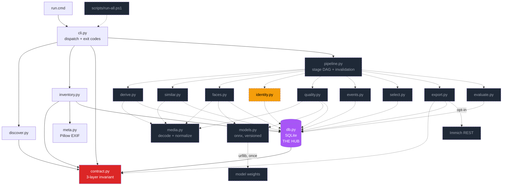

# CALL TREE — Photo Curator

A map of **what calls what**, from CLI entry point down to every process, network, and GPU
boundary — covering both the code that exists and the pipeline it is meant to become.

**Two kinds of content, marked at every point.** Sections tagged `✅` were read off the source
on disk and re-verified on 2026-07-25. Sections tagged `❓` are a *proposal* — an argument to
be attacked, not a decision that has been made. See §10 for the ledger.

Scope: the full curation pipeline over a large personal library. The goal it is built
backwards from: *given "my son," return the good photos of him across every year, tagged and
organized, without ever touching an original.*

**What is actually on disk today** — 1,235 lines in `src/`, 675 in `tests/`:

```
cli.py 175 · contract.py 213 · db.py 270 · discover.py 145 · inventory.py 276 · meta.py 156
tests/test_core.py 477 · tests/test_contract_paths.py 198    40 tests, 1 skipped, all passing
```

There is no `pipeline.py`, `media.py`, `models.py`, `store.py`, or `scripts/`. Every module
named in §4.1–§4.9 is unwritten.

**Notation**

| Symbol | Meaning |
|---|---|
| `└─ fn()` | direct function call |
| `⇒ PROC` | process boundary (`subprocess`) |
| `⇒ NET` | network boundary |
| `⚡ GPU` | heavy inference — the stage that dominates wall clock |
| `💾 cache` | reads the decode cache instead of the original (see §6) |
| `≫ file` | writes |
| `≪ file` | reads |
| `🔒` | non-destructive contract enforcement point |
| `♻` | idempotent — keyed by `(asset, stage, model_version)`, safe to re-run |
| `❓` | **hypothesis** — plausible, not yet validated against real data |
| `✅` | built and tested today |

---

## 1. Entry points

```
┌─ INTERACTIVE — the only entry point that exists ✅ ───────────────────────────┐
│ .\run [--derived <dir>] <command> [--root <library>] [flags]                  │
│   run.cmd                                                                     │
│     └─ resolve interpreter, first match wins per line, LAST line wins:        │
│          %LOCALAPPDATA%\...\Python313\python.exe                              │
│          %LOCALAPPDATA%\...\Python312\python.exe   ← overwrites 313 if present │
│          py -3.13  ->  py -3.12                    ← only if neither path hit │
│     ⇒ PROC  <py> src\cli.py <args>                                            │
│     └─ propagates ERRORLEVEL through `endlocal &` — exit 2 survives ✅ verified │
└───────────────────────────────────────────────────────────────────────────────┘

┌─ UNATTENDED — designed, NOT built ❓ ─────────────────────────────────────────┐
│ scripts\run-all.ps1     ← this file does not exist                            │
│     └─ per stage in DAG order: invoke, tee to logs/<stage>-<date>.log         │
│     └─ 🔒 snapshot before / verify after  — the run FAILS on library drift    │
└───────────────────────────────────────────────────────────────────────────────┘
```

`--derived` is a **global** flag and must precede the subcommand. It defaults to `./derived`
and may never resolve inside the library — the contract refuses (§5).

The unattended path is the intended primary one, and everything below is designed so that
killing it at any moment loses at most one asset of work. It is worth saying plainly that it
is currently a paragraph in a document, not a script.

`❓` **Latent interpreter inversion.** The `for` loop sets `PC_PY` on every line that matches,
so the *last* match wins: with both installed, 3.12 is chosen over 3.13. Only Python313 is
present on this machine, so the bug is dormant, not fixed.

---

## 2. Dispatch ✅

```
main(argv)                                                   cli.py:124
 ├─ argparse: global --derived, then one subparser per command
 ├─ dispatch dict                                            cli.py:156
 │    ├─ "inventory" -> cmd_inventory   --root, --rescan, --hydrate    ✅ stage 0
 │    ├─ "discover"  -> cmd_discover    --roots, --min-files           ✅ pre-stage
 │    ├─ "census"    -> cmd_census                                     ✅
 │    ├─ "dupes"     -> cmd_dupes                                      ✅
 │    ├─ "snapshot"  -> cmd_snapshot    --root                    🔒   ✅
 │    ├─ "verify"    -> cmd_verify      --root                    🔒   ✅
 │    ├─ "audit"     -> cmd_audit                                 🔒   ✅
 │    └─ "test"      -> cmd_test        unittest discover              ✅
 └─ except ContractViolation -> print + return 2      ← a refusal, not a traceback
    except db.IndexMissing   -> print + return 1
```

Exit codes are part of the interface and are asserted by the call-path tests: `0` success,
`1` missing index, `2` contract violation *or* verify drift.

**Not built ❓** — every stage below is absent from the dispatch dict:

```
      "derive" (1) · "similar" (2) · "faces" (3) · "identity" (4) · "quality" (5)
      "events" (6) · "select" (7) · "export" (8) · "evaluate" (9) · "all"
```

`pipeline.py` — which would own stage ordering and **invalidation**, so that changing the
embedding model invalidates stages 4+ and nothing earlier — does not exist. Without it you
either re-run everything on every tweak (hours) or hand-track staleness (wrong). It is the
first structural piece the current code is missing, and nothing downstream is safe to build
without it.

`✅` **Stage numbering resolved 2026-07-25 — this file's 0–9 is canonical.** It previously
collided with `README.md`, which numbered 0–6, had no `derive` stage, and folded `events` into
selection, so "stage 3" meant *faces* here and *identity* there. This numbering wins because
it names the decode cache, which is load-bearing (§6), and separates `events` from `select`,
which are different operations on different inputs. `README.md`'s table has been rewritten to
match; there is now one numbering.

---

## 3. The spine

```
0 inventory ──> 1 derive ──> 2 similar ──┐
                     │                    ├──> 6 events ──> 7 select ──> 8 export
                     ├──> 3 faces ──> 4 identity ──┤
                     └──> 5 quality ───────────────┘
                                                   └──> 9 evaluate (measures 7)
```

| # | Stage | Reads | Writes | Cost at 100k | Built |
|---|---|---|---|---|---|
| — | discover | dirents (stat only) | stdout | minutes | ✅ |
| 0 | inventory | originals (headers only) | `assets`, `paths`, `runs` | minutes | ✅ |
| 1 | derive | originals (full decode) | cache + `derived` | **~1-2 h, I/O bound** | ❓ |
| 2 | similar | 💾 cache | `phash`, `burst_id` | ~10 min | ❓ |
| 3 | faces | 💾 cache | `faces`, `embeddings` | **~2-6 h ⚡ GPU** | ❓ |
| 4 | identity | `embeddings` | `clusters`, `identity` | ~20 min + human labeling | ❓ |
| 5 | quality | 💾 cache + `faces` | `scores` | ~30 min, + ⚡ on subset | ❓ |
| 6 | events | `assets` | `event_id` | seconds | ❓ |
| 7 | select | everything | `selections` | seconds | ❓ |
| 8 | export | `selections` | sidecars, manifests | minutes | ❓ |
| 9 | evaluate | `selections` + labels | `metrics/kpi.jsonl` | seconds | ❓ |

Stages 1 and 3 are the whole runtime. Every design decision below exists to avoid doing them
twice. The 100k figure is inherited from the original plan and is now known to be wrong for
this machine — see §4.0.

---

## 4. Stage call trees

### 4.-1 `cmd_discover` — where is the library at all ✅

```
cmd_discover(args)                                         discover.py
├─ roots = args.roots or cli._default_roots()       ← home + every non-C: drive root
│    (all of C:\ is a tour of Windows and Program Files — opt-in via --roots)
├─ discover.scan(roots, min_files=25)
│   └─ os.walk, prune contract.SKIP_DIRS + discover.NOISE_DIRS + dotdirs
│      └─ per media file:  os.stat ONLY — never opens a byte
│         ├─ per_dir[dir]: n, bytes, exts
│         └─ contract.is_cloud_placeholder(st) -> cloud count
│   └─ roll every dir's tally up into ALL ancestors -> subtree view
└─ discover.report(result)
    └─ _candidates(): keep a node only if it holds < 85% of its parent's count
         ← walking up, every ancestor inherits the full count, so C:\ always "wins"
```

Written in Python rather than PowerShell on purpose: it reuses `contract.is_cloud_placeholder`
and `inventory.MEDIA_EXTS` directly, so the placeholder bitmask cannot exist in two copies
free to drift.

### 4.0 `cmd_inventory` — what do I actually have ✅

```
cmd_inventory(args)                                        inventory.py:64
├─ db.recorded_root(derived)                        ≪ runs.root, immutable=1 (zero writes)
├─ db.open_index(derived, root)                     ≫ derived/index.db (WAL)
│    └─ 🔒 contract.guard_output(...) lives INSIDE this call — see §5
├─ IF prior root != root -> print a note, continue   ← content-keyed, so it is safe
├─ db.start_run(con, "inventory", root)             ≫ runs   ← how later stages find the root
├─ db.known_paths()                                 ← resume cache, ONE query, ~MBs at 100k
│
├─ per file in contract._walk(root, MEDIA_EXTS):           ♻
│  ├─ st = path.stat()                              → OSError -> failed++, continue
│  ├─ IF (size, mtime_ns) unchanged -> skipped++            ← the resume test, FIRST
│  ├─ IF is_cloud_placeholder(st) and not --hydrate -> placeholder++
│  ├─ inventory.fingerprint(path, size)             🔒 contract.open_source, 'rb' only
│  │    └─ sha256(size ‖ head 256KB ‖ tail 256KB)   ← ~100x cheaper than a full hash
│  ├─ IF ext in IMAGE_EXTS:                         ← videos get EMPTY meta, by design
│  │    └─ meta.read_meta(fh, ext)                  ≪ Pillow + pillow-heif, headers only
│  │         └─ exif.get_ifd(IFD.Exif) for DateTimeOriginal — NOT in IFD0
│  ├─ meta.best_date(md, path, mtime) -> (iso, provenance)   ← exif > filename > mtime
│  ├─ db.upsert_asset()  (ON CONFLICT DO NOTHING)   → new += is_new
│  ├─ db.upsert_path()   (ON CONFLICT DO UPDATE)
│  └─ every 500 files: con.commit() + progress line ← a kill loses ≤ 500 assets of work
│
└─ finally: commit; db.finish_run(...); con.close()
   └─ cli prints inventory.census(derived)
```

`--rescan` empties the resume cache; `--hydrate` reads cloud stubs anyway, which forces a
real download. Both flags are load-bearing on this machine and neither was in the previous
version of this document.

**What it found on the real machine (2026-07-25, revised same day).** Three indexes exist.

| index | root | walked | placeholders | indexed |
|---|---|---|---|---|
| `derived/` | `C:\Users\terri\OneDrive\Pictures` | 397 | 259 (65%) | **138** |
| `derived-icloud/` | `C:\Users\terri\iCloudPhotos\Photos` | 33,095 ⚠ | 33,093 (99.99%) | **2** |
| `derived-d/` | `D:\iCloudPhotos\Photos` | 16,756 | 16,756 (100%) | **0** |

`⚠` That row is **not a third library and not a real count.** It is the `D:` library reached
through the junction, mid-sync, walked at a different moment than the row below it. Both iCloud
rows describe the same bytes. The number is retained only because the sections below argue
against it.

`❗` **Three facts in the previous revision were wrong. All three mattered.**

**`C:\Users\terri\iCloudPhotos` is a junction to `D:\iCloudPhotos`** — reparse tag
`0xa0000003`, substitute name `\??\D:\iCloudPhotos`. There is one library and it already lives
on D:. The two "separate" iCloud indexes above walked the same bytes through two paths, which
is the multi-path case `paths`/`assets` exists to handle and the likeliest explanation for the
33,095 figure. **The storage blocker is resolved**: ~201 GB of library against 930 GB free.

**There is HEIC, and it is the dominant format** — 12,141 of 17,257 files (71%) at the time of
measurement, and still 71% (19,774 of 27,804) when re-measured ten thousand files later. Both
denominators are mid-sync snapshots; the *ratio* is the durable finding, not either count. The claim that iCloud for Windows stores only JPEG conversions is false for this
library, which removes the main argument for pulling originals off the phone over USB. The
files are real iPhone HEICs and carry EXIF, so `same_device` in §4.4 will be populated once
they are readable.

**The library is mid-sync and was growing throughout the session** — media file count
measured at 15,255 → 15,505 → 16,506 → 16,756 → 17,035 → 17,257 → **19,508 (201.1 GB)** over
roughly ninety minutes, and **27,804 (217.9 GB)** at 07:01 the following morning — a further
43% with no sign of tapering. Any census taken against this root is a moving target, including
the one in the table above. The final size is not yet known.

**This section is the only place in the repo that carries absolute figures for this library.**
Every other file defers here rather than freezing a number of its own, because a number written
down elsewhere is wrong within the hour and there is no mechanism that would tell you.

**It is still 100% dehydrated.** Zero assets indexed, zero bytes readable. The blocker is
unchanged in force, only in remedy: hydrate in place on D: (now possible) rather than pull
from the phone.

**`(n)` filename variants are not duplicates.** 4,047 files carry an `(n)` suffix, which reads
as ~24% waste and invites a name-based collapse. Tested: **4,299 of 4,330 variants differ in
size from their same-extension base; only 21 match.** These are distinct photographs that
collided on filename because iPhone recycles `IMG_nnnn` across devices and restores. Filename
is not an identity key in this library, a name-based dedup would have destroyed thousands of
real photos, and the content fingerprint in `inventory.fingerprint` is doing necessary work
rather than being fastidious.

**The tree is a single flat folder** — every media file at the root, no subdirectories at any
count. §4.4 depends on this, and it depends on the *shape*, not the size.

**The 138 "readable" OneDrive assets are not photographs.** 134 of them are
`OneDrive\Pictures\Overwolf\MetaTFT\*.jpeg` — game-overlay screenshots — and the remaining 4
are stray PNGs. Zero carry EXIF, zero carry a camera make or model, and 100% of dates come from
mtime. The census reporting "138 assets, 2026" is describing a screenshot folder.

**The two hydrated iCloud assets are the only real photographs in reach**, and they are worth
more than their count suggests:

```
2024-05-17T10:00:03  exif  Apple / iPhone 13 Pro  4032x3024   2.5 MB
2023-05-14T22:48:33  exif  (no make/model)        1290x1506   0.2 MB
```

Both resolved a capture date from `DateTimeOriginal` in the Exif sub-IFD, and one carries a
full camera make/model — so `meta.py`'s Pillow path is confirmed working on a live file from
the real library, not only on the opt-in fixture set.

So the blocker is precise: **stage 1 has two photographs to decode.** That is enough to smoke-
test a decode path and nothing like enough to prototype §4.4, which needs the same child across
several years.

### 4.0.1 `cmd_census` / `cmd_dupes` ✅

```
cmd_census(args)                                           inventory.py:174
├─ db.open_existing(derived)          ← URI mode=rw, CANNOT create; needs no --root
│    └─ IndexMissing -> cli returns 1
├─ IF total == 0 AND last_run.n_placeholder -> explain the cloud case explicitly
│    ← "run inventory first" would be flatly false for a 100%-stub library
└─ format: by format · by year · date provenance · top cameras · decisions informed
   └─ trailing !! banner when the last run skipped placeholders

cmd_dupes(args)                                            inventory.py
├─ db.open_existing(derived)
├─ SELECT qhash FROM paths GROUP BY qhash HAVING COUNT(*) > 1   ← multi-path assets
└─ per group: full_sha256(ONE member, LIMIT 1) ≫ assets.sha256
     ⚠ records a digest — does NOT compare members. See below.
```

`⚠` **The exact half of the two-phase hash does not close.** `dupes` hashes one member per
group and stores it, so a *false* fingerprint collision — two different files sharing size,
head 256 KB and tail 256 KB — is never detected. It is also already lost by then:
`upsert_asset` is `ON CONFLICT DO NOTHING`, so the second file's dimensions, date and camera
were discarded at insert and its path row now resolves to the first file's asset. Two distinct
photographs become one row and `dupes` reports success.

Reachability is low for camera JPEGs (a per-shot EXIF timestamp lives in the head 256 KB) and
non-zero for machine-generated files from one encoder or large video containers. Closing it
needs an asset-splitting path that does not exist. Until then the behaviour is pinned by
`tests/test_core.TestFingerprintCollision`, and the CLI says what it actually did rather than
claiming confirmation.

Neither takes a `--root`. That is not a convenience: they run *after* inventory, so the root is
recoverable from `runs.root`, and `open_existing` has no capability to create a database
anywhere. Removing the capability beats checking for it — see §5.

### 4.1 `cmd_derive` — decode once, forever ❓ *(not built)*

**The most important unbuilt stage.** Stages 2, 3 and 5 all need pixels. Decoding a large
library five times is five times the most expensive operation in the pipeline. So decode
*once*, normalize, and cache.

```
cmd_derive(args)                                           derive.py   ← does not exist
└─ ProcessPoolExecutor(max_workers=cpu_count-1)     ← decode is CPU-bound
   └─ per asset not yet derived:                           ♻
      ├─ 🔒 contract.open_source(path)
      ├─ media.decode(fh, ext)
      │    └─ Pillow + pillow-heif                  ← NOT a hand-rolled parser (see §11)
      ├─ media.normalize(img)
      │    ├─ apply EXIF orientation                ← ONCE, here, or every stage re-does it
      │    ├─ convert to sRGB
      │    └─ resize long edge -> 1024 (LANCZOS)
      ├─ media.thumb(img, 256)                      ← for the review UI
      └─ ≫ derived/cache/<hash[:2]>/<hash>.webp     💾 the artifact everything else reads
           ≫ derived/thumbs/<hash[:2]>/<hash>.webp
```

Sizing: 100k × ~120 KB ≈ **12 GB of cache** — the deliberate trade of 12 GB of disk against
re-decoding 400 GB four more times. Cache lives under `derived/`, so it is disposable.

`❓` The 1024px working size is a guess. Face embedding models want ~112px crops and detectors
work fine at 640px, so 1024 is probably generous; validate against detection recall on a
sample before committing 12 GB.

### 4.2 `cmd_similar` — near-duplicates and bursts ❓ *(not built)*

```
cmd_similar(args)                                          similar.py
├─ per asset:  💾 cache
│   └─ phash.dhash(img, 8)  -> 64-bit int                  ♻
├─ BK-tree index over hashes                        ← not O(n²); 100k pairwise is 5e9 compares
│   └─ query radius <= 6 bits -> near-dup candidate groups
└─ burst grouping: same phash-neighborhood AND capture_at within 3s
    ≫ db: near_dup_group, burst_id
```

Bursts matter more than dedup here: "pick the best of the 12 shots you fired at the birthday
candles" is most of the perceived value of the whole tool.

### 4.3 `cmd_faces` — detect and embed ⚡ ❓ *(not built)*

```
cmd_faces(args)                                            faces.py
├─ models.load("scrfd_10g", "arcface_r100")         ≪ derived/models/*.onnx
│    └─ onnxruntime, CUDA provider -> CPU fallback
├─ batched over 💾 cache (batch 32)                        ♻ keyed (asset, model_version)
│   ├─ detector(img) -> [bbox, kps, det_score]
│   ├─ align(img, kps) -> 112x112 crop               ← standard 5-point affine
│   ├─ recognizer(crops) -> 512-d embedding, L2-normalized
│   └─ db.add_faces(asset, [bbox, score, embedding, crop_sharpness])
└─ ≫ derived/faces/<hash>.npy  (embeddings; SQLite holds the index, not the vectors)
```

`crop_sharpness` is computed **here**, while the aligned crop is already in memory — stage 5
needs it and re-cropping later would mean re-reading the cache.

`❓` Model choice (SCRFD + ArcFace via InsightFace) is the conventional pick, not a researched
one. The dd brief showed a third-party tool driving Immich with ResNet152 + Qdrant, which is
evidence the general approach works at 100k scale but says nothing about which model is best
for children.

### 4.4 `cmd_identity` — cross-age chaining ❓ **the hard problem** *(not built)*

This is the stage no off-the-shelf tool does, and the reason this project exists rather than
just installing something. Face embeddings are trained for *adult* identity invariance. A child
from 2 to 15 lands in several disjoint clusters under any global clustering — Immich included.

```
cmd_identity(args)                                         identity.py
│
├─ ── WITHIN-WINDOW CLUSTERING ───────────────────────────────────────────────
├─ windows = bucket assets by captured_at, ~120 days each
├─ per window:
│   ├─ embeddings = db.load_window(w)
│   └─ AgglomerativeClustering(metric=cosine, distance_threshold=0.45)
│        -> local clusters                          ← a child is stable INSIDE a 4-month window
│
├─ ── CROSS-WINDOW CHAINING (the actual contribution) ────────────────────────
├─ per adjacent (w, w+1):
│   └─ bipartite match on cost =
│        cosine(centroid_a, centroid_b)                        ← weakest signal for a child
│        − λ₁ · co_occurrence(a, b)      ❓ the strongest signal
│        − λ₂ · same_device(a, b)                              ← EXIF Make/Model continuity
│        − λ₃ · household_prior(a, b)                          ← appears in the same folders
│   └─ scipy.optimize.linear_sum_assignment
│
├─ ── LABELING (human, once) ─────────────────────────────────────────────────
├─ chains = connected components over matched clusters
├─ ⇒ open a small local review page: one representative face per chain
│   └─ human confirms "this chain is <person>"     ← minutes of work, not hours
├─ chain confidence decays per hop; below threshold -> ASK rather than assume
└─ db.assign_identity(chain -> person_id, confidence)
```

**Why co-occurrence is the key term.** An adult's face *is* stable across 15 years. So if
cluster A (window N) and cluster B (window N+1) both frequently share a frame with the same
stable adult identity, that is strong evidence A and B are the same child — evidence that comes
from the *photo graph*, not the face pixels, and is therefore immune to the aging problem that
breaks the embedding. Adults act as beacons that anchor the child's chain across time.

`❓` Every λ in that cost function is invented. They must be fit against the labeled sample from
stage 9, not chosen by argument. This section is the single largest source of risk in the design
and the first thing that should be prototyped on a few hundred photos before anything else here
is built.

**How bad the aging problem actually is, measured.** The previous revision asserted the
premise without a number. On the ITLF longitudinal infant-and-toddler benchmark — FaceNet,
ArcFace, MagFace and CosFace over 630 images of 30 subjects across seven sessions — the best
model scored **30.7% TAR at 0–6 months against 64.7% at 2.5–3 years**, and fell to **14.9% TAR
once the enrolment-to-verification gap reached 20–24 months**
([arxiv 2601.01680](https://arxiv.org/html/2601.01680)). The authors conclude recognition
"becomes increasingly feasible" only after roughly age 2.5–3, and that multi-year reliability
"remains fundamentally limited." That is the gap this stage exists to close, and it is wider
than the design assumed.

`❗` **`household_prior` is structurally unavailable — corrected 2026-07-25.** The previous
revision said `same_device` and `household_prior` were "null for 100% of assets" and that the
prototype merely needed real camera files. Half of that is now wrong in a way no amount of
data fixes: **the library is a single flat folder with no subdirectories** (§4.0), so
"appears in the same folders" has no signal to read. Not null-until-hydrated — permanently
absent for this library.

So the cost function has **three usable terms, not four**:

```
  cosine(centroid_a, centroid_b)     available · weakest signal for a child
− λ₁ · co_occurrence(a, b)           available · now carrying more weight than planned
− λ₂ · same_device(a, b)             available once hydrated — real iPhone HEICs with EXIF
− λ₃ · household_prior(a, b)         ✗ STRUCTURALLY UNAVAILABLE — flat tree, no folders
```

This raises the stakes on co-occurrence rather than lowering them. It was already described
below as "the strongest signal"; it is now the only structural signal, with the embedding
term measured to be weak exactly where it matters most. If co-occurrence does not carry the
chain, there is no third thing to fall back on.

### 4.5 `cmd_quality` — objective first, taste second ❓ *(not built)*

```
cmd_quality(args)                                          quality.py
│
├─ ── PASS 1 · cheap, on EVERYTHING ──────────────────────────────────────────
├─ per asset:  💾 cache                                    ♻
│   ├─ tech.sharpness_face(img, faces)      ← Laplacian var on the FACE CROP, not the frame
│   │      (global sharpness punishes correct portrait bokeh — measure what matters)
│   ├─ tech.exposure(img)                   ← histogram clipping at both ends
│   ├─ tech.eyes_open(kps)                  ← landmark aspect ratio per face
│   └─ db.add_scores(asset, technical={...})
│
├─ ── GATE ───────────────────────────────────────────────────────────────────
├─ candidates = assets WHERE technical_ok AND person_id = target
│      (100k -> maybe 10-15k — the gate is what makes pass 2 affordable)
│
└─ ── PASS 2 · expensive, on the survivors only ⚡ ───────────────────────────
    ├─ models.load("clip_vit_l14") -> embedding
    ├─ aesthetic_head(embedding) -> scalar     ← CLIP+MLP, per the scorecard brief
    └─ db.add_scores(asset, aesthetic=...)
```

**Why objective metrics lead.** Off-the-shelf aesthetic heads are trained on crowd taste over
generative imagery. A family archive is a different distribution: a slightly soft, badly lit
photo of your kid mid-laugh is a keeper that a LAION-trained head scores near the floor. So the
aesthetic score is a **tiebreaker within an event**, never a gate on its own, and its weight is
calibrated in stage 9 rather than asserted.

### 4.6 – 4.7 `cmd_events` / `cmd_select` ❓ *(not built)*

```
cmd_events(args)                                           events.py
└─ sort by captured_at; new event when gap > 6h OR GPS jump > 25 km
    ≫ db: event_id                             ← "the birthday party", not "April"

cmd_select(args, person, per_event=3)                      select.py
├─ pool = assets WHERE person_id=person AND technical_ok
├─ collapse burst_id / near_dup_group -> keep best member  ← or you get 12 near-copies
├─ rank within event by  w_t·technical + w_a·aesthetic + w_f·face_size + w_s·smile
├─ take top-N per event                        ← NOT global top-N
└─ ≫ db: selections(person, event, rank, score_breakdown)
```

Global top-N is the obvious approach and it is wrong: it returns 500 photos from the three best
days of 15 years. Per-event selection is what produces "his childhood," which is the actual ask.

`score_breakdown` is stored per selection so any pick can be explained — necessary when you are
trusting an unattended job over 100k files and need to debug *why* something was chosen.

`❓` Stage 6 keys on GPS, which `inventory` does not currently extract. `meta.read_meta` reads
Make, Model, Orientation, dimensions and the three date tags — no GPS IFD. Either stage 6 loses
the 25 km term or `meta.py` grows a GPS reader first.

### 4.8 `cmd_export` — reversible by construction ❓ 🔒 *(not built)*

```
cmd_export(args)                                           export.py
├─ 🔒 contract.guard_output(..., library_root) on each output path
├─ "manifest"  ≫ derived/albums/<person>-<year>.json    ← lists of paths, source of truth
├─ "xmp"       ≫ <workcopy>/<filename>.<ext>.xmp        ← rating + tags; name is NOT ours to pick
├─ "links"     ≫ derived/albums/<person>-<year>/*.lnk   ← hardlinks; 0 bytes, browsable
└─ "immich"    ⇒ NET  POST /api/people  then  POST /api/faces   [best-effort, opt-in]
     └─ requires IMMICH_URL + IMMICH_API_KEY from its own env read, never the pipeline's
```

**Both far-side contracts were wrong in the previous revision — corrected 2026-07-25.**

`❗` **The sidecar path could never have worked.** It read
`≫ derived/sidecars/<hash>.xmp`. Immich resolves a sidecar only as `<filename>.jpg.xmp`
adjacent to its media file, with `<filename>.xmp` as a fallback; a bare content hash in a
separate directory is unreadable at any price
([xmp-sidecars](https://docs.immich.app/features/xmp-sidecars/)). The old note framed
in-place sidecars as an optional `--inplace-sidecars` nicety. It is not optional — it is the
only form the consumer can read.

What resolves the tension is the working copy (§4.0). Sidecars land beside the **working
copy**, never beside the source tree, so Immich gets the adjacency it requires and layer 3
still guards the originals. `derived/sidecars/` survives only as an export format for tools
that accept an arbitrary path.

`❗` **The Immich endpoints named neither of the things we need.** `POST /api/albums` and
`/api/assets/tags` carry no person label. The pair that does is `POST /api/people` to create
the person, then `POST /api/faces` with `{assetId, personId, imageWidth, imageHeight, x, y,
width, height}`, which requires the `face.create` permission
([walkthrough](https://gist.github.com/skatsubo/3beda82b175277aa50fdbddf5ed1fefa)).

Three limits on that route, none of them obvious from the endpoint list:

- The only published walkthrough supplies **zero-dimension placeholder boxes** and then adds
  the real face by hand. Pushing genuine coordinates at scale is unproven and needs a probe.
- The sidecar alternative for faces is narrower still: Immich reads face regions only in
  **digiKam format**, assets carrying face metadata **skip face detection entirely**, those
  faces never join recognition clustering, and grouping degrades to name matching
  ([PR 6455](https://github.com/immich-app/immich/pull/6455), v1.114.0).
- Immich extracts exactly **five** fields from a sidecar — description, rating, date/time,
  GPS, tags. Everything else, including any custom score, stays in the `.xmp` and is
  explicitly not searchable. Star rating and tags are first-class search filters, so the
  quality score has a real delivery surface; nothing else does.

### 4.9 `cmd_evaluate` — the honesty gate ❓ *(not built)*

Directly modeled on `judge.py` in the research repo: a system that makes subjective calls needs
a measurement it cannot argue with.

```
cmd_evaluate(args)                                         evaluate.py
├─ ≪ labels/holdout.jsonl        ← YOU label ~500 assets ONCE: (is_target_person, is_keeper)
├─ predictions = db.selections + db.identity
├─ identity  : precision / recall / F1 per year   ← does chaining survive age 3 -> age 11?
├─ selection : precision@N per event
├─ composite = 0.5·identity_f1 + 0.5·selection_p@3
└─ ≫ metrics/kpi.jsonl    ← TRACKED, cumulative, one record per run
```

**This is what makes every weight in §4.4 and §4.7 an empirical question instead of an argument.**
Label once; every subsequent tuning change is measured against the same holdout. Without this
stage the whole pipeline is vibes with a database attached.

---

## 5. 🔒 The contract as an execution chain ✅

```
  ORIGINALS ARE READ-ONLY, FOREVER
        │
        ├── LAYER 1 · CONSTRUCTION ──────────────────────────────────────
        │     contract.open_source()        the only sanctioned reader, mode 'rb'
        │     contract.self_audit()         greps src/ for _FORBIDDEN mutators
        │       shutil.move · shutil.rmtree · shutil.copyfile( · os.remove
        │       os.unlink · os.rename · os.replace · os.truncate · .unlink( · .rename(
        │       (bare `.replace(` deliberately NOT listed — str vs Path is
        │        undecidable by grep, and false positives kill an audit's credibility)
        │
        ├── LAYER 2 · CONTAINMENT ───────────────────────────────────────
        │     contract.guard_output(p, root)  refuses any write resolving inside root
        │                                     also the ONE creator of derived/
        │
        │     Reached through exactly ONE door, because an optional guard is a
        │     forgettable one:
        │       db.open_index(derived, library_root)  the only fn that can CREATE
        │            the index; library_root is MANDATORY and positional, so
        │            forgetting to guard is a TypeError, not a silent hole
        │       db.open_existing(derived)             URI mode=rw — cannot create
        │            anything at all, so it needs no root
        │       db.recorded_root(derived)             immutable=1 — no journal, no
        │            -wal/-shm, not one byte written; how the root is known BEFORE
        │            any open that would need checking
        │       contract._FUNNELLED, audited: `import sqlite3`, `from sqlite3`,
        │            `sqlite3.connect(`, `._open(`  — all confined to db.py
        │
        └── LAYER 3 · VERIFICATION ──────────────────────────────────────
              contract.snapshot(root, manifest, exts)   before  ≫ manifest.jsonl
                    (JSONL; header record persists the ext filter)
              contract.verify(root, manifest)           after -> ADDED/CHANGED/MISSING
                    (filter replayed from the header, so the two sides cannot
                     disagree and manufacture false violations)
```

Layer 3 catches what layers 1 and 2 cannot: a **third-party library** writing behind our
back — and stages 1, 3 and 5 all pull in third-party code.

**Layer 3 fired for real on 2026-07-25, and it was not us.** `verify --root
C:\Users\terri\OneDrive\Pictures` returned exit 2 with 8 `ADDED` files, all
`Overwolf/MetaTFT/League of Legends-*.jpeg` written by a game overlay during the session. The
mechanism works end to end. It also proves something about the *root*: `OneDrive\Pictures` is a
shared OS folder with active third-party writers, so it is not a library you can bracket a
long-running job around. Whatever root the real pipeline runs against has to be one nothing
else writes to, or layer 3 becomes noise and stops being read.

**Then it fired again, sixty times harder, and settled the architecture.** `verify --root
D:\iCloudPhotos\Photos` returned exit 2 with **`CONTRACT VIOLATED — 500 file(s) drifted`**
roughly twenty minutes after the snapshot — every one `ADDED`, none of them ours. iCloud's
sync engine wrote them. Over the same session the library grew by roughly 28% (§4.0).

The OneDrive incident showed a verifier can be made noisy by an occasional writer. This shows
something stronger: **against a live sync root, layer 3 is not noisy, it is inoperative.** A
game overlay writes to your library by accident; iCloud writes to it as its entire purpose.
There is no threshold that separates its writes from ours.

Hence the working copy. The pipeline runs against a hydrated copy on a drive nothing else
touches, materialized by `robocopy` with no deleting or moving flag — read-only with respect
to the source by construction, and no code in this package participates in it. That is not a
performance or fidelity decision; **it is the only way to keep layer 3 at all**, and the
contrast is the proof: the same command that returns 500 drifted files against `D:` must
return `CONTRACT HELD` against the working copy.

**Layer 3's blind spot, and why layer 2 is structural.** `contract.SKIP_DIRS` prunes `derived/`,
so a database created at `<library>/derived/index.db` produces *zero* drift from `verify`. That
is not hypothetical: `census()` and `resolve_duplicates()` opened the index unguarded for a
while, and all three layers missed it while 16 tests stayed green (layer 1's grep did not list
`sqlite3.connect`, layer 2 was not called, layer 3 pruned the directory). The pruning stays —
you do not want to snapshot a 12 GB cache — which is exactly why layer 2 had to become
structural rather than one more check. `tests/test_contract_paths.py` T7 asserts the blindness
on purpose, and T4 asserts the guard was *consulted*, not merely satisfied.

---

## 6. Why the cache layer is load-bearing ❓

```
   WITHOUT cache                          WITH cache (§4.1)
   ─────────────                          ──────────────────
   similar  -> decode 100k full-res       derive   -> decode 100k ONCE  ≫ 12 GB
   faces    -> decode 100k full-res       similar  -> 💾
   quality  -> decode 100k full-res       faces    -> 💾
                                          quality  -> 💾
   3 × ~400 GB read + 3 × decode          1 × 400 GB read + 1 × decode
```

Plus a correctness benefit that is easy to miss: EXIF orientation is applied **once**, in
`normalize()`. Every stage that decodes independently is a stage that can forget to rotate, and
a sideways face is a face the detector misses.

---

## 7. Boundary inventory

| # | Boundary | Call site | Status |
|---|---|---|---|
| 1 | file I/O — originals | `contract.open_source` | ✅ 🔒 read-only, the only reader |
| 2 | file I/O — index | `db._open` (sqlite3) | ✅ 🔒 one door, audited |
| 3 | ⇒ PROC interpreter launch | `run.cmd` -> `src\cli.py` | ✅ |
| 4 | ⚡ onnxruntime — detector + recognizer | `faces.py` | ❓ not built |
| 5 | ⚡ onnxruntime — CLIP + aesthetic head | `quality.py` | ❓ not built |
| 6 | ⇒ NET model download (once) | `models.py` | ❓ not built; pinned SHA, cached in `derived/models/` |
| 7 | ⇒ NET Immich REST | `export.py` | ❓ not built; opt-in, own env vars |
| 8 | ⇒ PROC exiftool | *(proposed)* | ❓ **not built and not in `meta.py`** — Pillow-only today |

The code as it stands makes **no network calls and spawns no subprocesses** beyond the
interpreter launch in `run.cmd`. Boundaries 6 and 7 would be the only network access; the
pipeline is fully functional air-gapped once models are cached.

---

## 8. Module graph



Solid lines and filled boxes exist. Dashed boxes are §4's proposal.

`db.py` is the hub every stage talks to — the structural analogue of `orchestrator.py` in the
research repo. **The previous revision of this document called it `store.py`** in §4.3–§4.9
and in the graph, while §4.0 correctly called it `db.py`; there is one module and its name is
`db.py`. `contract.py` is the module with no dependencies and the most authority — note that
`db.py` depends on it, and imports it as a *module* so that `mock.patch.object` in T4 stays
visible.

---

## 9. Data model

**Built today ✅** — `db.SCHEMA`, verbatim shape:

```sql
assets (qhash PK, sha256, size, ext, mime, width, height, captured_at,
        capture_source, make, model, orientation, first_seen)
paths  (path PK, qhash FK->assets, size, mtime_ns, last_seen)
runs   (id PK AUTOINCREMENT, stage, root, started_at, finished_at,
        n_seen, n_new, n_skipped, n_placeholder, n_failed, notes)

idx_paths_qhash · idx_assets_capture · idx_assets_ext
```

Three things about this are load-bearing and were understated before:

- `paths.size` and `paths.mtime_ns` **are** the resume cache. `db.known_paths()` loads them once
  into a dict, which turns the per-file resume test into a lookup rather than a query.
- `runs.root` is not telemetry. `db.recorded_root()` reads it back with `immutable=1`, and it is
  how `census` and `dupes` recover the library root without a `--root` flag. Dropping the column
  breaks layer 2.
- `runs.n_placeholder` is why `census` can distinguish "you never ran inventory" from "inventory
  ran and every file was a cloud stub" — two situations with opposite remedies.

**Proposed ❓** — none of these tables exist:

```sql
derived    (qhash PK, cache_path, thumb_path, derived_at)
phash      (qhash PK, dhash, near_dup_group, burst_id)
faces      (id PK, qhash FK, bbox, det_score, crop_sharpness, embedding_path, model_version)
clusters   (id PK, window, centroid_path, model_version)
chains     (id PK, person_id, confidence)
face_cluster (face_id, cluster_id) · cluster_chain (cluster_id, chain_id)
scores     (qhash PK, technical_json, aesthetic, scored_at, weights_version)
events     (qhash PK, event_id)
selections (person_id, event_id, qhash, rank, score_breakdown_json)
stage_state(qhash, stage, model_version, done_at)    -- ♻ the idempotency ledger
```

`stage_state` keyed by `(qhash, stage, model_version)` is what makes swapping a model invalidate
exactly the right rows and no others. Skip it and every experiment costs a full re-run. Nothing
in the current schema does this job — `runs` records that a stage ran, not which assets it
finished.

---

## 10. Proven vs. hypothesis

Deliberately explicit, because an earlier version of this document asserted the whole
architecture as settled and that was a mistake.

| Claim | Status |
|---|---|
| Non-destructive contract, 3 layers | ✅ built — 40 tests pass, `audit` clean |
| Layer 2 is structurally unbypassable | ✅ built — one door, mandatory root, audit-enforced |
| Layer 3 detects a real third-party writer | ✅ **demonstrated** — 8 ADDED, exit 2, §5 |
| Cheap phase of the two-phase hash (fingerprint) | ✅ built and tested |
| Exact phase (`dupes` confirming a collision) | ❌ **does not hold** — digests one member, never compares; pinned by `TestFingerprintCollision` |
| Interrupted run closes its ledger | ✅ built — `finish_run` moved inside the `finally`, both branches tested |
| Cloud-placeholder detection | ✅ built — and decisive; see below |
| EXIF via Pillow + pillow-heif | ✅ built — opt-in fixture set, **and** a live iPhone 13 Pro file from the real library |
| Census informs the format/date decisions | ✅ built and run against two real roots |
| `discover` locates a library from stat alone | ✅ built |
| Exit codes survive `run.cmd` | ✅ verified — verify=2, census=0 |
| Immich as external library, not owner | Inference from the dd brief's lossy-iOS finding. Sound, untested |
| Immich as the **face detector** over that external library | ❌ **contradicted** — three reports show face detection not running on external libraries ([23879](https://github.com/immich-app/immich/issues/23879), [23131](https://github.com/immich-app/immich/issues/23131), [23880](https://github.com/immich-app/immich/discussions/23880): `facesRecognizedAt` NULL). Moot regardless — it never exposes per-face embeddings, which §4.4 requires |
| Immich mount is safe by default | ❌ **false** — a volume not ending `:ro` lets Immich delete the files ([libraries docs](https://docs.immich.app/features/libraries/)). `:ro` is now a contract concern |
| Person labels can be pushed back into Immich | Endpoints confirmed — `POST /api/people` then `POST /api/faces`, `face.create` permission. **Real bounding boxes at scale unproven**; the only published walkthrough uses zero-dimension placeholders |
| Sidecars at `derived/sidecars/<hash>.xmp` feed Immich | ❌ **impossible** — requires `<filename>.jpg.xmp` adjacent to the media file. Resolved by writing beside the working copy (§4.8) |
| Layer 3 works against the real library root | ❌ **false for the sync root** — 500 files drifted in ~20 min against `D:\iCloudPhotos\Photos` (§5). Works only against the isolated working copy |
| `C:` and `D:` iCloud paths are two libraries | ❌ **false** — `C:\Users\terri\iCloudPhotos` is a junction to `D:\iCloudPhotos`; one library, already on D: |
| "The library contains no HEIC" | ❌ **false** — 71% HEIC, holding at that ratio across two measurements ten thousand files apart (§4.0). The USB-transfer argument rested on this |
| `(n)` filename variants are duplicates | ❌ **false** — 4,299 of 4,330 differ in size from their base; only 21 match. Filename is not an identity key here |
| `household_prior` available once we have real data | ❌ **structurally unavailable** — flat single-folder tree, no folders to compare (§4.4) |
| Cross-age degradation is severe | ✅ **measured** — 30.7% TAR at 0–6 mo vs 64.7% at 2.5–3 y; 14.9% at a 20–24 mo gap ([ITLF](https://arxiv.org/html/2601.01680)) |
| CLIP+MLP for aesthetics, NIMA for technical | From the scorecard brief. Never run on family photos |
| `pipeline.py` DAG + invalidation | ❓ **not built** — nothing tracks per-asset stage state |
| Unattended runner (`run-all.ps1`) | ❓ **not built** — the "primary path" is a paragraph |
| Decode-once cache at 1024px | ❓ design only. Size unvalidated |
| Cross-age chaining via co-occurrence | ❓ **the core bet, zero evidence** |
| Every λ and weight in §4.4 / §4.7 | ❓ invented. Must be fit in stage 9 |
| SCRFD + ArcFace model choice | ❓ conventional, not researched, not child-specific |
| 6h/25km event thresholds | ❓ plausible defaults, and GPS is not even extracted yet |

The honest summary: **stage 0 and the contract are real and now have field evidence behind
them. Everything downstream of stage 0 is unwritten**, and the interesting part of it is a
hypothesis. If cross-age chaining does not work, this design's premise collapses and the answer
is probably "use Immich's clustering and hand-merge the child's identities once a year."

**The blocker still outranks all of it, and its remedy changed on 2026-07-25.** Every media
file under `D:\iCloudPhotos\Photos` is a dehydrated stub — 100% of them, at every count §4.0
has taken. Of the 140 local
files under the OneDrive root, 134 are game screenshots and 4 are stray PNGs — leaving
**exactly 2 real photographs**, one a genuine iPhone 13 Pro original. Two assets is enough to
smoke-test a decoder and nowhere near enough to prototype §4.4, which needs one child across
many years.

What changed is the cure, not the diagnosis. The library is already on `D:` with 930 GB free,
so **hydrating in place is now possible** — it was not, when the library was believed to be a
475 GB tree on a system drive with 64 GB free. And because HEIC turns out to be 71% of the
files rather than absent, pulling originals off the phone over USB is no longer the better
route; it is a check on what the cloud may be missing, not the primary path.

The sequence is therefore: let the sync settle (it is still growing), hydrate, copy to an
isolated working root so layer 3 becomes operative, then index. It remains a storage and
data-acquisition decision rather than an engineering one, and it still gates everything.

---

## 11. Where this differs from what is on disk

| | Built | This design | Status |
|---|---|---|---|
| EXIF | ~~250 lines hand-rolled stdlib~~ | Pillow + pillow-heif (`meta.py`) | ✅ **done** |
| Layer 2 | ~~guarded at 1 of 3 write sites~~ | one door, mandatory root, audit-enforced | ✅ **done** |
| Library discovery | ~~none~~ | `discover.py`, stat-only, reuses the placeholder rule | ✅ **done** |
| Hub module name | `db.py` | ~~`store.py`~~ | ✅ **doc corrected** — one module, called `db.py` |
| Decode | none — no stage needs pixels yet | dedicated cache stage | pending §4.1 |
| Stage deps | implicit; `runs` records runs, not assets | `pipeline.py` DAG + `stage_state` | pending §2 / §9 |
| Unattended run | none | `scripts/run-all.ps1` bracketed by snapshot/verify | pending §1 |
| GPS | not extracted | needed by stage 6's 25 km rule | pending §4.6 |
| Aesthetic scoring | none | gated pass 2, tiebreaker only | pending §4.5 |
| Exact dedup | digests one member, cannot detect a false collision | compare all members, split divergent assets | **known gap** — §4.0.1, pinned by test |
| Stage numbering | ~~README 0–6 vs this file 0–9~~ | one numbering, 0–9 | ✅ **resolved** — README rewritten to match, see §2 |
| Immich's role | ~~viewer + face detector + search~~ | viewer + search only | ✅ **corrected** — §4.8, §10, CONTRACT.md |
| Sidecar location | ~~`derived/sidecars/<hash>.xmp`~~ | `<filename>.<ext>.xmp` beside the working copy | ✅ **corrected** — the old path was unreadable by the consumer |
| Pipeline root | ~~the iCloud library itself~~ | an isolated working copy on another drive | ✅ **corrected** — §5, 500-file drift |

Two corrections worth keeping visible.

The Pillow migration was justified partly by HEIC support. A census then appeared to refute
that justification — it reported the library contained **no HEIC**, attributed to iCloud for
Windows converting to JPEG on sync — and an earlier revision of this file recorded the
refutation as settled fact. **The refutation was wrong.** HEIC is 71% of the library (§4.0,
§10). The original justification stands, and it stands alongside the migration's other reason:
the hand-rolled parser had never read a real camera file, and its fixture shared an author
with the parser.

The lesson that replaces it is the better one. That census was run against a mid-sync,
junction-doubled root — two paths to one library, counted twice, while iCloud was still
writing. It returned a confident, specific, wrong answer, and that answer reached this
document and changed an architecture decision (it was the whole argument for pulling originals
off the phone over USB). No test failed, because no test was involved. It is the pattern named
below, escaping the test suite into measurement: **an input that could not exercise the
claim.** The format finding was generalized from the only assets the census could actually
read — 138 of them, of which 134 were game-overlay screenshots and none were photographs
(§4.0). The iCloud library's own files were 100% dehydrated and contributed two assets. A
sample of Overwolf JPEGs was allowed to answer a question about a family photo archive.

The previous revision said "stage 0 exists today" and then described stages 1–9 in the present
tense with `store.` calls that resolve to nothing. That reads as a codebase six modules further
along than it is. Everything unwritten is now marked at its heading, and the module it would
live in is named as absent.

**And the one worth naming as a pattern, because it is now four for four.** The contract
guard was tested in isolation while two call paths bypassed it. The hand-rolled EXIF parser
was validated against a fixture written by its own author. `dupes` was tested only on a
byte-identical copy — the one input on which the phase that exists to catch collisions cannot
fail. And the "no HEIC" census read 138 game screenshots and reported on a family photo
archive. Each time the property was asserted in a doc, marked ✅, and backed by a green result
that could only ever come out that way.

This project's characteristic defect is not a missing check; it is **a check whose input cannot
exercise the claim.** Three of the four were tests, which made the fourth easy to miss — the
census was not a test, nobody thought to ask what would make it fail, and it changed an
architecture decision before anyone did. The standing question for anything marked ✅ here is
**"what input would make this fail, and did the thing that produced this number ever see
one?"** — T7 in `test_contract_paths.py` and `TestFingerprintCollision` are what answering that
honestly looks like on the test side. On the measurement side, the answer is §4.0's habit of
recording what a number could not have known.

---

## 12. Quick reference

1. **What can I actually run today?** `discover`, `inventory`, `census`, `dupes`, `snapshot`,
   `verify`, `audit`, `test`. That is the whole surface.
2. **Where does the time go?** Stages 1 and 3, once they exist. Everything else is noise.
3. **What is blocking everything?** Data, not code. See §10 — there are no readable family
   photos on this machine.
4. **What must I label by hand?** One representative per chain in stage 4 (minutes), and ~500
   assets once for stage 9 (an hour). That is the entire human cost.
5. **What is the riskiest thing here?** §4.4. Prototype cross-age chaining on a few hundred
   real photos spanning several years *before* building anything downstream of it.
6. **What can I delete safely?** All of `derived*/`. Always. That is the contract.
